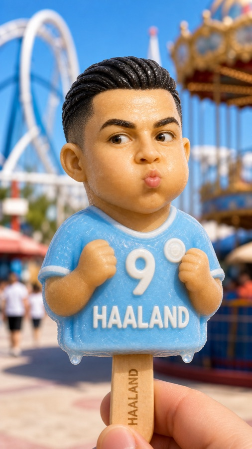
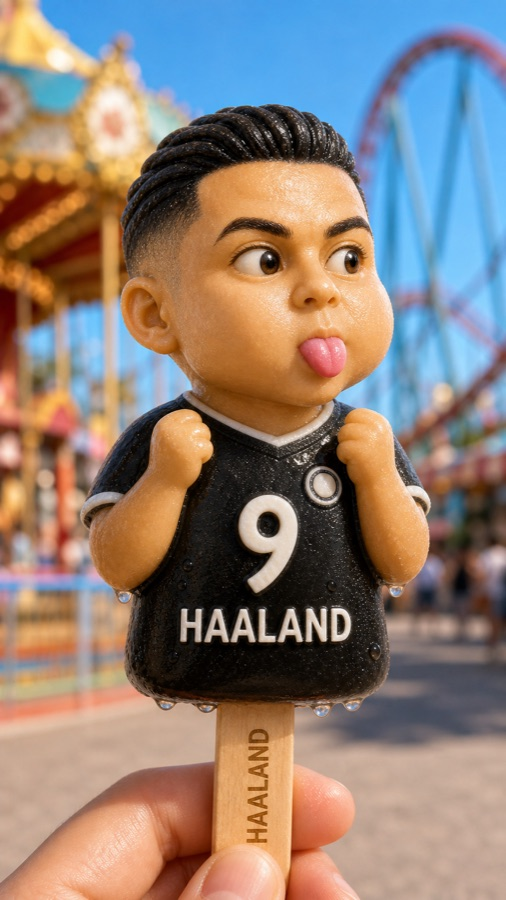

# 万物皆可哈兰德

把任意一张人物参考图，变成固定风格的 **HAALAND 人物雪糕图**。

这个 Skill 的目标不是简单换脸，而是把人物的五官识别点、发型轮廓、配饰特征保留下来，同时统一替换成“哈兰德雪糕”系列的材质、姿势、球衣、表情和游乐园背景。

## 生成效果

默认一张人物图生成四种固定造型：

- 天蓝球衣亲亲脸：双拳握起，Q 版雪糕人像。
- 黑色球衣吐舌：侧脸看向一边，俏皮表情。
- 天蓝打坐款：盘腿悬坐，双手 OK 手势。
- 奶油飞行款：奶油色半身像，飞行姿态，强调头发和五官雕刻感。

## 示例展示

### 我也能变成哈兰德

<table>
  <tr>
    <td align="center"><br>天蓝亲亲脸</td>
    <td align="center"><br>黑衣吐舌</td>
    <td align="center"><br>天蓝打坐</td>
    <td align="center"><br>奶油飞行</td>
  </tr>
</table>

### 梅西变成哈兰德

<table>
  <tr>
    <td align="center"><br>天蓝亲亲脸</td>
    <td align="center"><br>黑衣吐舌</td>
    <td align="center"><br>天蓝打坐</td>
    <td align="center"><br>奶油飞行</td>
  </tr>
</table>

### 姆巴佩变成哈兰德

<table>
  <tr>
    <td align="center"><br>天蓝亲亲脸</td>
    <td align="center"><br>黑衣吐舌</td>
    <td align="center"><br>天蓝打坐</td>
    <td align="center"><br>奶油飞行</td>
  </tr>
</table>

### C罗变成哈兰德

<table>
  <tr>
    <td align="center"><br>天蓝亲亲脸</td>
    <td align="center"><br>黑衣吐舌</td>
    <td align="center"><br>天蓝打坐</td>
    <td align="center"><br>奶油飞行</td>
  </tr>
</table>

## 使用方式

在 Codex 中使用：

```text
$wanwu-jieke-haaland
```

或者直接说：

```text
帮我把这张人物图生成四张雪糕图
```

## 文件

- `SKILL.md`
- `agents/openai.yaml`
- `assets/examples/`
